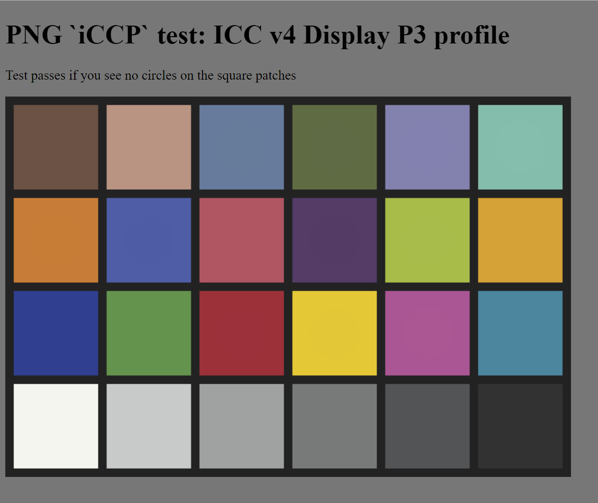
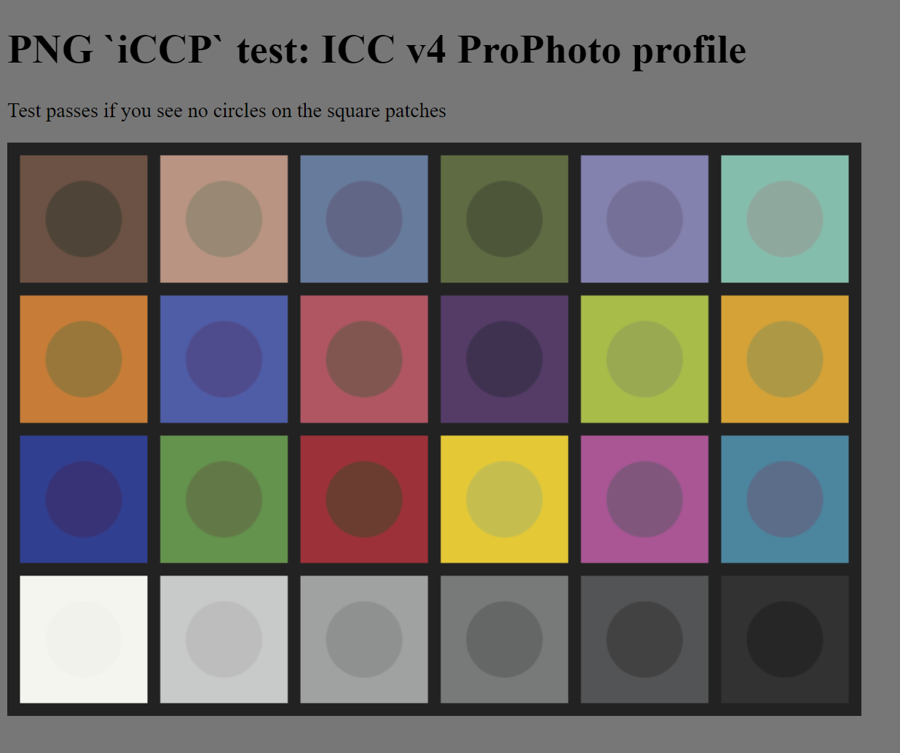
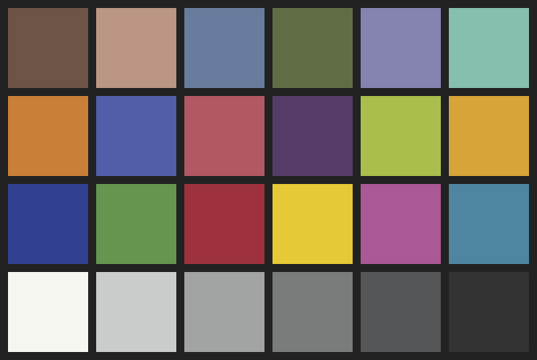
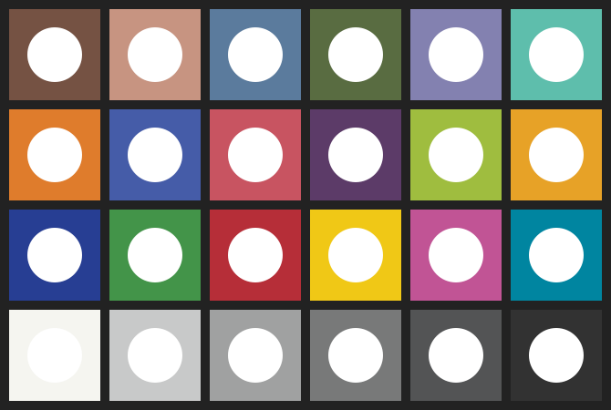

# PNG tests of iCCP chunk

## How to run the tests

For [each test](tests.md), compare with the reference image,
which is in sRGB.

The test passes if you cannot see any circles
in the middle of each patch.
The test fails if the circles
(which are in a variety of colorspaces,
indicated by an embedded ICC profile
stored in the [PNG `iCCP` chunk](https://w3c.github.io/PNG-spec/#11iCCP))
are visibly different to the surrounding rectanguar patches (in sRGB).
This failure indicates that the PNG image data is not being interpreted
according to the embedded ICC profile.

[Test results](results.md)

### Typical pass

### Typical Fail

## Detailed test explanation

_Or, what to do if your browser is failing the tests
so you are pretty sure
the browser is right and the tests must be wrong._

### Color checker Lab values

The test images show a Macbeth color checker,
which is an industry standard test chart
of 24 colored patches in a 6x4 grid.
The  D50 CIE Lab values (calculated from averaged measured spectra of 20 test charts)
of each patch [are known](https://babelcolor.com/colorchecker-2.htm#CCP2_data).

<table>
<tr>
<td>dark skin lab(38.358 13.802 14.646)</td>
<td>light skin lab(66.056 17.737 17.848)</td>
<td>blue sky lab(50.090  -4.407 -22.51)</td>
<td>foliage lab(43.204 -13.464 21.73)</td>
<td>blue flower lab(55.356   8.891 -24.82)</td>
<td>bluish green lab(70.700 -32.892 -0.24)</td>
</tr>
<tr>
<td>orange lab(62.559 35.135 58.050)</td>
<td>purplish blue lab(40.178   9.551 -44.289)</td>
<td>moderate red lab(51.711 47.694 16.857)</td>
<td>purple lab(30.375 21.131 -20.30)</td>
<td>yellow green lab(72.492 -23.462 57.07)</td>
<td>orange yellow lab(71.963 19.486 67.998)</td>
</tr>
<tr>
<td>blue lab(28.653 15.600 -50.52)</td>
<td>green lab(55.046 -38.088 31.61)</td>
<td>red lab(42.182 54.893 28.785)</td>
<td>yellow lab(82.230   4.048 79.844)</td>
<td>magenta lab(51.820 49.787 -13.90)</td>
<td>cyan lab(50.555 -27.973 -28.13)</td>
</tr>
<tr>
<td>white 9.5 lab(96.387  -0.404   2.238)</td>
<td>neutral 8 lab(81.014  -0.570   0.180)</td>
<td>neutral 6.5 lab(66.297  -0.434 -0.079)</td>
<td>neutral 5 lab(50.830  -0.687 -0.268)</td>
<td>neutral 3.5 lab(35.724  -0.521 -0.468)</td>
<td>black 2 lab(20.706   0.025   -0.447)</td>
</tr>
</table>

### sRGB version of color checker

As a starting point, the patches were converted to sRGB.

These tests are designed to be run on a normal screen; a wide gamut screen is not required.
Thus, because the `cyan` patch is outside the sRGB gamut,
(lab(50.555 -27.973 -28.13) is color(srgb -0.2 0.528 0.657))
for these tests the CIE LCH chroma was reduced to lab(50.555 -23.759 -23.900)
so that it was within gamut.

The sRGB values below are rounded to 8-bit (0 to 255) precision and given as decimal values.

<table>
<tr>
<td>dark skin rgb(117 82 67)</td>
<td>light skin rgb(199 148 129)</td>
<td>blue sky rgb(91 123 157)</td>
<td>foliage rgb(89 108 65)</td>
<td>blue flower rgb(131 129 176)</td>
<td>bluish green rgb(94 190 172)</td>
</tr>
<tr>
<td>orange rgb(223 124 44)</td>
<td>purplish blue rgb(69 92 168)</td>
<td>moderate red rgb(200 84 97)</td>
<td>purple rgb(92 59 104)</td>
<td>yellow green rgb(159 189 63)</td>
<td>orange yellow rgb(231 162 39)</td>
</tr>
<tr>
<td>blue rgb(39 62 147)</td>
<td>green rgb(67 148 73)</td>
<td>red rgb(182 46 56)</td>
<td>yellow rgb(240 200 22)</td>
<td>magenta rgb(193 84 149)</td>
<td>desat_cyan rgb(0 133 160)</td>
</tr>
<tr>
<td>white 9.5 rgb(245 245 240)</td>
<td>neutral 8 rgb(200 201 201)</td>
<td>neutral 6.5 rgb(160 161 161)</td>
<td>neutral 5 rgb(120 121 121)</td>
<td>neutral 3.5 rgb(83 84 85)</td>
<td>black 2 rgb(50 50 50)</td>
</tr>
</table>

### Color checkers converted to other color spaces

To make each test, the sRGB colors
were converted to a different RGB colorspace
by applying an ICC profile.
The profile was also embedded in the PNG image,
in an  `iCCP` chunk.
[See 12.3.2.3 iCCP Embedded ICC profile](https://w3c.github.io/PNG-spec/#11iCCP).

The test consists of the test image,
overlaid with an RGBA sRGB image
which produces a patch of the correct color
with a circular hole in the middle of each patch
to allow the test image to show.
If the ICC profile is being applied,
the patch and the circle (the test image, showing through) will be the same color
so the circles will not be visible.

The test reference is just sRGB patches,
with no circles.
This will be a visual match
(color difference will be significantly below 1 deltaE2000)
and should be an image match
(color difference less than 1 bit at 8 bits/component).

### Browsers tested

- Firefox Nightly 100.0a1 (2022-03-29) (64-bit) on Windows 10 `gfx.color_management.mode` was set to 1 (full color management)
- Chrome Canary Version 102.0.4999.0 (Official Build) canary (64-bit) on Windows 10
- Microsoft Edge Version 100.0.1185.39 (Official build) (64-bit) on Windows 10
- Safari Technology Preview release 143 (Safari 15.4, WebKit 17614.1.7.7) on OS X Monterrey 12.2.1

On Windows, test system was a Dell XPS 9560 with the 4k WCG display.
Display was profiled with an [X-Rite i1Pro2 spectrophotometer](https://www.xrite.com/categories/calibration-profiling/i1photo-pro-2) and
[DisplayCAL](https://displaycal.net/) software.

On Mac, test system was a MacBook Pro 16-inch 2019, using the factory Display P3 profile.

## ICC profiles used

These are in the profiles directory.

### ICC v2 profiles

- [sRGB v2, from ICC](https://www.color.org/srgbprofiles.xalter). Filename: `sRGB-v2-2014.icc`
- sRGB with red and green colorants swapped. Filename: `swapped-v2.icc`
- [ProPhoto RGB from Elle Stone](https://ninedegreesbelow.com/photography/lcms-make-icc-profiles.html#ProphotoRGB), gamma 1.8. Filename: `LargeRGB-elle-V2-g18.icc`
- [CIE RGB from Elle Stone](https://ninedegreesbelow.com/photography/lcms-make-icc-profiles.html#CIERGB), CIE L* TRC. Filename: `CIERGB-elle-V2-labl.icc`

### ICC v4 profiles

- [sRGB v4 Preference, from ICC](https://www.color.org/srgbprofiles.xalter). Filename: `sRGB-v4-ICC_preference.icc`
- [ProPhoto RGB from Elle Stone](https://ninedegreesbelow.com/photography/lcms-make-icc-profiles.html#ProphotoRGB),, gamma 1.8. Filename: `LargeRGB-elle-V4-g18.icc`
- [CIE RGB from Elle Stone](https://ninedegreesbelow.com/photography/lcms-make-icc-profiles.html#CIERGB), CIE L* TRC. Filename: `CIERGB-elle-V4-labl.icc`
- [Display P3 from ICC and Apple](https://www.color.org/chardata/rgb/DisplayP3.xalter). Filename: `Display P3.icc`

### iccMAX profiles

In progress. Considering using the [sRGB iccMAX profiles](https://www.color.org/iccmax/profiles/srgb-iccmax.xalter),
but edited to swap the red and green channels
so that it is obvious that they have been applied.

## Creating the test files

Documenting the process, for verification and as a reminder should tests need to be added or modified.

### Initial sRGB images

The sRGB test image was [created in SVG](./workings/macbeth-sRGB.svg) and then
a color-accurate conversion of SVG to PNG was created with [SVGtoPNG](https://svgtopng.com/).
The RGB values were verified by dumping the palette entries:

pngcheck -p foo.png

and then checking them off one by one against the expected RGB values.

For the reference, the mask image was [created in SVG](./workings/macbeth-circles.svg) then
rasterised with [SVGtoPNG](https://svgtopng.com/).
The [PNG raster mask](./workings/circles-mask.png)
was converted [to PGM](./workings/circles-mask.pgm) with netpbm tools
then merged in as an alpha channel using pnmtopng, again from NetPBM tools.

### Overview of colorspace conversions

1. Convert image data from sRGB to destination colorspace (I used [Little CMS Color Translator](https://www.littlecms.com/translator/), with relative colorimetric rendering intent, sRGB as source colorspace, and desired new colorspace as the destination colorspace.)
2. Run [PNGcheck](http://www.libpng.org/pub/png/apps/pngcheck.html) to be sure result is valid
3. If the conversion tool does not embed the profile (or embeds an incorrect or modified one) add in the profile. I used [pngcrush](https://pmt.sourceforge.io/pngcrush/).
4. If the conversion tool embedded the profile, extract it and check the ICC version and that it seems okay. (I used [exiftool](https://exiftool.org/) (actually [exiftool for Windows](https://oliverbetz.de/pages/Artikel/ExifTool-for-Windows)) and then [ICC profile inspector](https://www.color.org/profileinspector.xalter))
5. View the PNG image, in a browser
6. Make an HTML test file that overlays the result PNG with an sRGB reference.

### To apply an ICC profile

For ICC v2 or v4 profiles, LittleCMS is a good implementation.
*It does not support ICC2 (iccMAX).*
LittleCMS itself is a library, but
there is an application, [Little CMS Color Translator](https://www.littlecms.com/translator/)
which provides a drag and drop image colorspace transformation.
The source and destination ICC profiles and the rendering intent are chosen in the options dialog,
then all dropped images are converted from source to destination.

For ICC2 (iccMax), IccApplyProfiles from
[DemoIccMAX](https://github.com/InternationalColorConsortium/DemoIccMAX)
is a command line utility to apply iccMAX frofiles.
Input and output images must be in TIFF format, only.
The NetPBM utilities can be used to convert between PNG and TIFF
(image data and alpha only).

### To extract ICC profile

The command to extract an existing ICC profile from an image is:

exiftool -icc_profile -b -w icc somefile.png

### To remove an ICC profile

To remove an embedded profile (for example to create a rendering of a test failure):

pngcrush -rem iCCP foo.png result.png

### To embed an ICC prolile

This just adds an ICC profile into an `iCCP` chunk;
it does not *apply* the profile to the image data,
which is assumed to already be in the colorspace
indicated by the profile.

To embed an ICC profile with exiftool, do this:

exiftool "-icc_profile<=somefile.icc" a.png

To embed an ICC profile using pngcrush:

pngcrush -iccp 536 "Profile name" foo.icc foo.png result.png

To list profile names, or profile descriptions:

exiftool -profiledescription *.png
exiftool -profilename *.png

### To read ICC profile and convert back to sRGB

As a round-trip test, I used [squoosh](https://squoosh.app/editor)
whose source is [on GitHub](https://github.com/GoogleChromeLabs/squoosh).
For PNG, Sqoosh uses [OxiPNG](https://github.com/shssoichiro/oxipng)
which is a multithreaded lossless PNG optimizer written in Rust.

As a filesize optimization, Squoosh removes embedded ICC profiles
by applying the profile to the image data
and outputting sRGB.
(Clearly, this is not lossless for colors outside the sRGB gamut).

https://squoosh.app/ (select OxiPNG as an encoder, leave resize and reduce palette alone).
Applies the embedded ICC to pixel data during processing, outputting sRGB values.
The palette indexes (there are only 25 unique colors in the image) can then be listed:

pngcheck -vv -p foo.png

and the rgb values compared with the sRGB values given above.

Here is the output of a png checker on a round-tripped sRGB image. The palette contains 25 colors:

    $ pngcheck -vv -p roundtrip.png
    File: roundtrip.png (1699 bytes)
    chunk IHDR at offset 0x0000c, length 13
        670 x 450 image, 8-bit palette, non-interlaced
    chunk PLTE at offset 0x00025, length 75: 25 palette entries
        0:  (200, 84, 97) = (0xc8,0x54,0x61)
        1:  ( 89,108, 65) = (0x59,0x6c,0x41)
        2:  (199,148,129) = (0xc7,0x94,0x81)
        3:  ( 92, 59,104) = (0x5c,0x3b,0x68)
        4:  ( 91,123,157) = (0x5b,0x7b,0x9d)
        5:  (200,201,201) = (0xc8,0xc9,0xc9)
        6:  (  0,133,160) = (0x00,0x85,0xa0)
        7:  ( 39, 62,147) = (0x27,0x3e,0x93)
        8:  (223,124, 44) = (0xdf,0x7c,0x2c)
        9:  (131,129,176) = (0x83,0x81,0xb0)
        10:  (240,200, 22) = (0xf0,0xc8,0x16)
        11:  ( 94,190,172) = (0x5e,0xbe,0xac)
        12:  (117, 82, 67) = (0x75,0x52,0x43)
        13:  (193, 84,149) = (0xc1,0x54,0x95)
        14:  ( 83, 84, 85) = (0x53,0x54,0x55)
        15:  (120,121,121) = (0x78,0x79,0x79)
        16:  (245,245,240) = (0xf5,0xf5,0xf0)
        17:  ( 50, 50, 50) = (0x32,0x32,0x32)
        18:  (231,162, 39) = (0xe7,0xa2,0x27)
        19:  ( 67,148, 73) = (0x43,0x94,0x49)
        20:  ( 34, 34, 34) = (0x22,0x22,0x22)
        21:  ( 69, 92,168) = (0x45,0x5c,0xa8)
        22:  (159,189, 63) = (0x9f,0xbd,0x3f)
        23:  (160,161,161) = (0xa0,0xa1,0xa1)
        24:  (182, 46, 56) = (0xb6,0x2e,0x38)
    chunk IDAT at offset 0x0007c, length 1555
        zlib: deflated, 32K window, default compression
        row filters (0 none, 1 sub, 2 up, 3 avg, 4 paeth):
        0 0 0 0 0 0 0 0 0 0 0 0 0 0 0 0 0 0 0 0 0 0 0 0 0
        0 0 0 0 0 0 0 0 0 0 0 0 0 0 0 0 0 0 0 0 0 0 0 0 0
        0 0 0 0 0 0 0 0 0 0 0 0 0 0 0 0 0 0 0 0 0 0 0 0 0
        0 0 0 0 0 0 0 0 0 0 0 0 0 0 0 0 0 0 0 0 0 0 0 0 0
        0 0 0 0 0 0 0 0 0 0 0 0 0 0 0 0 0 0 0 0 0 0 0 0 0
        0 0 0 0 0 0 0 0 0 0 0 0 0 0 0 0 0 0 0 0 0 0 0 0 0
        0 0 0 0 0 0 0 0 0 0 0 0 0 0 0 0 0 0 0 0 0 0 0 0 0
        0 0 0 0 0 0 0 0 0 0 0 0 0 0 0 0 0 0 0 0 0 0 0 0 0
        0 0 0 0 0 0 0 0 0 0 0 0 0 0 0 0 0 0 0 0 0 0 0 0 0
        0 0 0 0 0 0 0 0 0 0 0 0 0 0 0 0 0 0 0 0 0 0 0 0 0
        0 0 0 0 0 0 0 0 0 0 0 0 0 0 0 0 0 0 0 0 0 0 0 0 0
        0 0 0 0 0 0 0 0 0 0 0 0 0 0 0 0 0 0 0 0 0 0 0 0 0
        0 0 0 0 0 0 0 0 0 0 0 0 0 0 0 0 0 0 0 0 0 0 0 0 0
        0 0 0 0 0 0 0 0 0 0 0 0 0 0 0 0 0 0 0 0 0 0 0 0 0
        0 0 0 0 0 0 0 0 0 0 0 0 0 0 0 0 0 0 0 0 0 0 0 0 0
        0 0 0 0 0 0 0 0 0 0 0 0 0 0 0 0 0 0 0 0 0 0 0 0 0
        0 0 0 0 0 0 0 0 0 0 0 0 0 0 0 0 0 0 0 0 0 0 0 0 0
        0 0 0 0 0 0 0 0 0 0 0 0 0 0 0 0 0 0 0 0 0 0 0 0 0
        (450 out of 450)
    chunk IEND at offset 0x0069b, length 0
    No errors detected in indexed.png (4 chunks, 99.4% compression).

## Bugs

pngcrush -srgb 1 foo.png bar.png is supposed to add an sRGB chunk but sadly it adds a gAMA instead (!!) at least, if foo.png is indexed.
